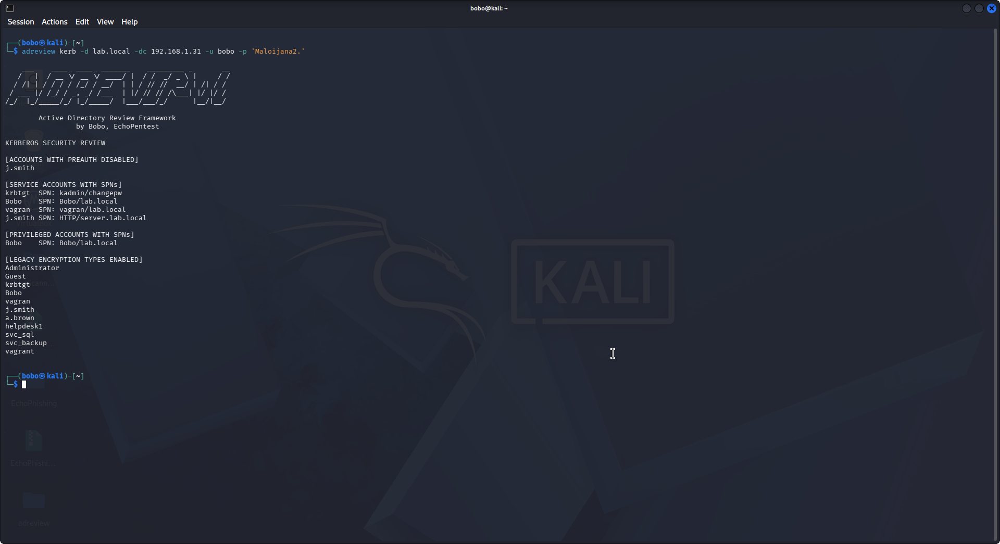
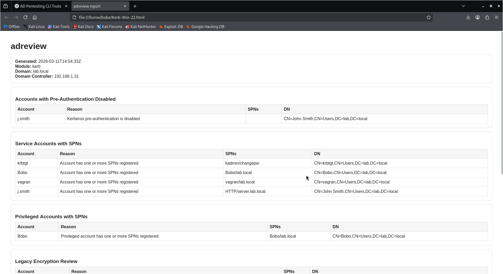
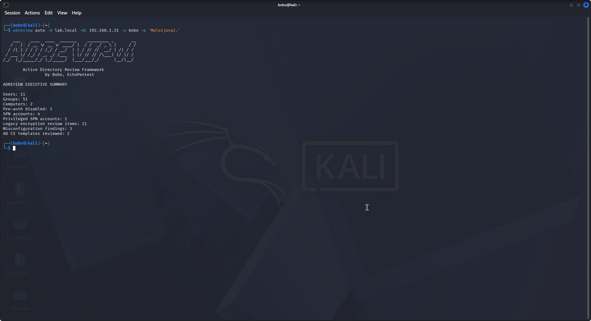

# ADReview

**Active Directory Review Framework**  
**Author:** Bobo Nikolov, EchoPentest

ADReview is a modular, read-only Active Directory security assessment toolkit written in Go. It is designed for configuration auditing, exposure review, and defensive reporting in enterprise environments.

## Why this project exists

Active Directory environments accumulate configuration drift, privilege sprawl, legacy Kerberos settings, unmanaged delegation, inconsistent GPOs, and broad administrative exposure. ADReview was built to provide a fast, operator-friendly CLI for reviewing those conditions through a structured, extensible framework.

---

## Core design goals

- Read-only assessment
- Enterprise-friendly CLI output
- Clear module separation
- JSON and HTML reporting
- Modular architecture for future expansion
- Defensive review only

---

## Features

- Kerberos exposure analysis
- Delegation auditing
- AD CS certificate surface review
- Privileged group scope analysis
- GPO enumeration
- Domain trust analysis
- Remote management surface discovery
- SMB exposure review
- ACL delegation indicators
- Tier 0 inventory
- Privilege sprawl review
- JSON / HTML reporting

---

## Modules

| Module | Description |
|---|---|
| `enum` | Domain inventory counts |
| `kerb` | Kerberos exposure review |
| `misconfig` | Configuration hygiene findings |
| `adcs` | AD CS summary |
| `gpoenum` | Group Policy Object inventory |
| `trustaudit` | Domain trust inventory |
| `delegaudit` | Delegation review |
| `certsurface` | Certificate template surface review |
| `adminscope` | Privileged group scope review |
| `lateralmap` | Remote administration surface inventory |
| `shareaudit` | SMB exposure inventory |
| `aclaudit` | Delegation and protected-object ACL indicators |
| `tierzero` | Tier 0 asset and identity inventory |
| `sprawl` | Privilege sprawl review |
| `auto` | Combined core assessment |

---

## Example

```bash
adreview auto -d corp.local -dc 10.10.10.5 -u 'CORP\auditor' -p 'Password123!'
Example output
Active Directory Review Framework
by EchoPentest

ADREVIEW EXECUTIVE SUMMARY

Users: 1532
Groups: 221
Computers: 412
Pre-auth disabled: 2
SPN accounts: 31
Privileged SPN accounts: 1
Legacy encryption review items: 6
Misconfiguration findings: 4
AD CS templates reviewed: 3

---

## Installation

### Build locally
go build -o adreview ./cmd/adreview

### Install globally
sudo cp adreview /usr/local/bin/adreview
sudo chmod +x /usr/local/bin/adreview
hash -r

---

## Usage

### Inventory
adreview enum -d corp.local -dc 10.10.10.5 -u 'CORP\auditor' -p 'Password123!'

###Kerberos review
adreview kerb -d corp.local -dc 10.10.10.5 -u 'CORP\auditor' -p 'Password123!' --password-age

### GPO review
adreview gpoenum -d corp.local -dc 10.10.10.5 -u 'CORP\auditor' -p 'Password123!'

### Tier 0 inventory
adreview tierzero -d corp.local -dc 10.10.10.5 -u 'CORP\auditor' -p 'Password123!'

### Privilege sprawl review
adreview sprawl -d corp.local -dc 10.10.10.5 -u 'CORP\auditor' -p 'Password123!'

### Reporting
adreview kerb -d corp.local -dc 10.10.10.5 -u 'CORP\auditor' -p 'Password123!' --json kerb.json
adreview auto -d corp.local -dc 10.10.10.5 -u 'CORP\auditor' -p 'Password123!' --html review.html

### Reporting outputs

- Human-readable CLI output

- JSON artifact for automation

- HTML report for review and sharing

### HTML Reporting

Each module can export structured HTML reports suitable for documentation or client reporting.

Example:

```bash
adreview kerb -d corp.local -dc 10.10.10.5 --html kerberos_report.html

---

## Architecture summary

LDAP collectors
      ↓
data models
      ↓
audit modules
      ↓
report engine
      ↓
CLI interface

More detail is available in docs/architecture.md.

---

## Safe scope

ADReview is designed for defensive assessment and reporting. It does not perform:

- credential extraction

- ticket requests for cracking

- exploit generation

- attack-path generation

- abuse command generation

- privilege escalation workflows

### Repository layout
adreview/
├── cmd/
├── internal/
├── docs/
├── examples/
├── .github/workflows/
├── go.mod
├── README.md
├── LICENSE
└── CHANGELOG.md
### What this project demonstrates

- Go development

- Active Directory internals

- LDAP collection patterns

- network exposure review

- modular CLI architecture

- reporting design

- security engineering mindset

---

## Screenshots

### Kerberos Security Review



### Kerberos HTML Report



## Privilege Sprawl Review


### Executive Summary




---

## Author

Bobo Nikolov, EchoPentest
