# ARGUS Modules

ARGUS is composed of multiple modules designed to provide visibility into Active Directory security posture.  
Each module focuses on a specific exposure surface or configuration domain.

---

# Inventory Modules

## enum
Domain inventory enumeration.

Collects high-level domain statistics including:

- Users
- Groups
- Computers

Purpose:

Establish a baseline of directory size and structure before deeper analysis.

---

## tierzero
Tier-0 asset and identity inventory.

Identifies critical security boundary components such as:

- Domain Controllers
- Enterprise Admins
- Domain Admins
- Schema Admins
- Key administrative identities

Purpose:

Define the Tier-0 trust boundary and enumerate identities capable of controlling the domain.

---

## gpoenum
Group Policy Object inventory.

Enumerates:

- All GPOs in the domain
- GUIDs
- Paths
- Change timestamps
- Configuration flags

Purpose:

Provide visibility into policy configuration affecting domain security.

---

## trustaudit
Domain trust inventory.

Enumerates domain and forest trust relationships including:

- Trust partner domains
- Trust direction
- Trust type

Purpose:

Identify external authentication paths and cross-domain exposure.

---

# Exposure Modules

## kerb
Kerberos exposure review.

Identifies Kerberos security weaknesses such as:

- Accounts with pre-authentication disabled
- Service accounts with SPNs
- Privileged accounts with SPNs
- Legacy encryption configurations
- Password age anomalies

Purpose:

Detect accounts vulnerable to Kerberoasting or AS-REP roasting.

---

## misconfig
Read-only misconfiguration review.

Detects common Active Directory misconfigurations including:

- Weak security configurations
- Privileged group exposure
- Misapplied permissions
- Operational security risks

Purpose:

Provide a high-level configuration risk assessment.

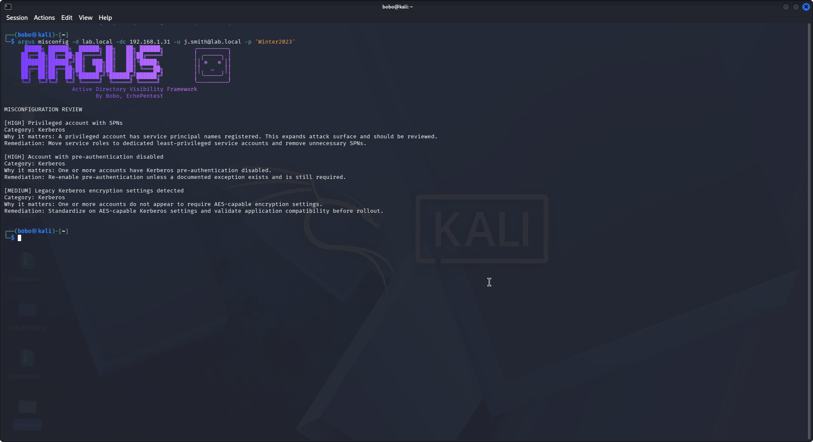

---

## shareaudit
SMB exposure inventory.

Enumerates hosts exposing SMB services and identifies potential lateral movement surfaces.

Purpose:

Highlight systems reachable through SMB that could be leveraged for movement or credential harvesting.

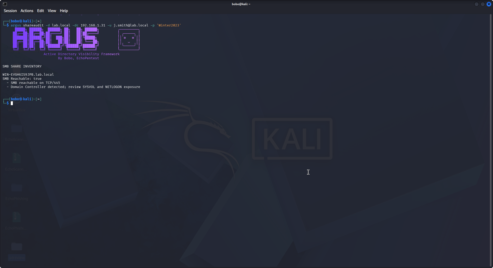

---

## lateralmap
Remote management surface inventory.

Identifies hosts supporting remote management services such as:

- WinRM
- RDP
- SMB

Purpose:

Map potential lateral movement paths across the domain.

---

## aclexposure
Dangerous ACL rights exposure review.

Detects objects where dangerous permissions are granted, including:

- GenericAll
- WriteDACL
- WriteOwner
- FullControl

Purpose:

Identify privilege escalation paths via directory ACL abuse.

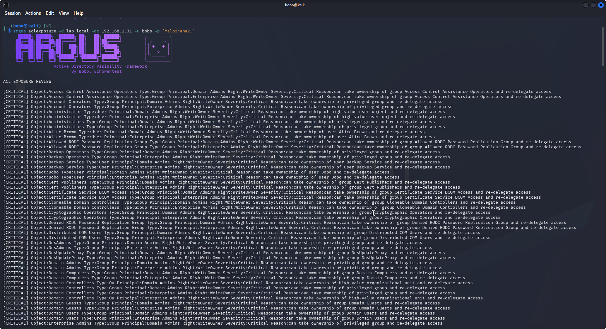

---

# Privilege Modules

## sprawl
Privilege sprawl review.

Detects excessive privilege distribution such as:

- Overly large privileged groups
- Nested administrative groups
- Excessive administrative membership

Purpose:

Highlight privilege concentration risks.

---

## privmap
Privileged group membership mapping.

Maps the full membership structure of privileged groups including:

- Nested groups
- Service accounts
- Administrative users

Purpose:

Provide a complete privilege inheritance map.

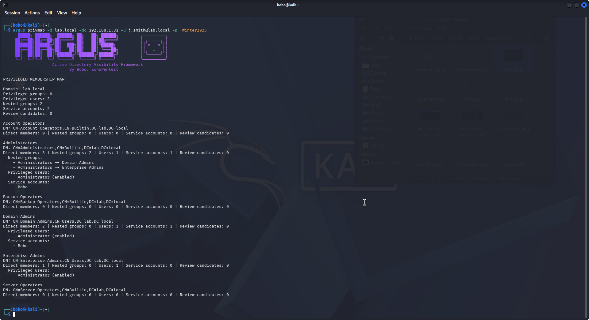

---

## adminscope
Privileged group scope review.

Analyzes how far privileged groups extend across the directory structure.

Purpose:

Identify unexpected privilege propagation.

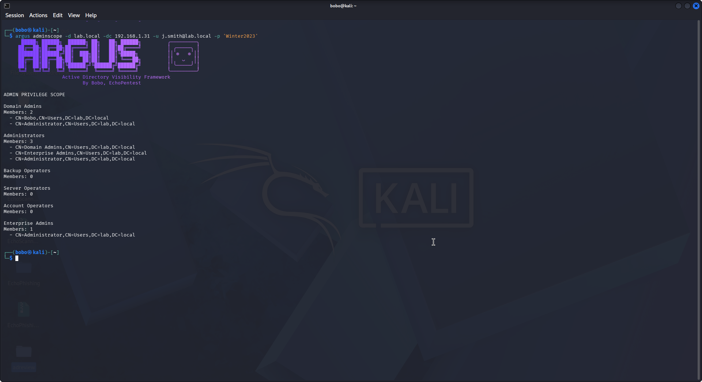

---

## blast
Defender-oriented blast radius prioritization.

Ranks identities and systems based on potential control spread.

Evaluates:

- Privileged identity concentration
- Service account reuse
- Privilege aggregation points

Purpose:

Help defenders prioritize containment and remediation efforts.

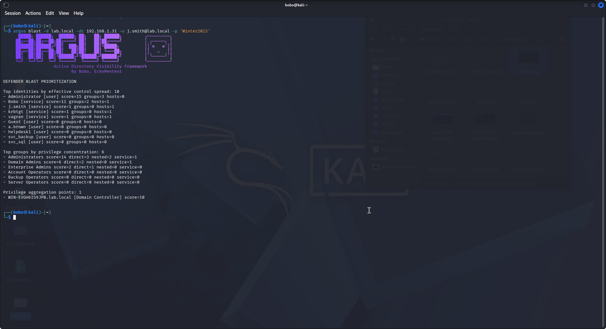

---

## adminsd
AdminSDHolder and SDProp drift review.

Detects anomalies related to:

- AdminSDHolder protections
- adminCount attribute
- Broken inheritance
- Persistent protected objects

Purpose:

Identify persistence mechanisms and security descriptor drift.

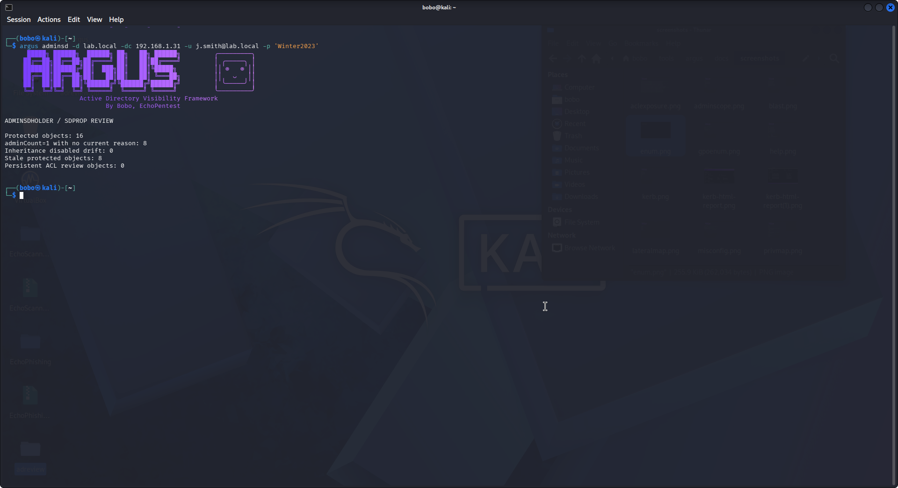

---

## serviceimpact
Service account privilege and dependency review.

Analyzes service accounts for:

- Privileged group membership
- Host dependencies
- SPN exposure

Purpose:

Understand impact if a service account becomes compromised.

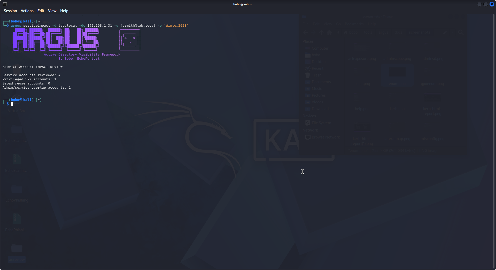

---

## dcattacksurface
Domain Controller exposure inventory.

Identifies attack surface on domain controllers including:

- Who can log on to DCs
- Non-standard accounts present on DCs
- Protocol exposure
- GPOs affecting DCs
- Delegation anomalies

Purpose:

Assess exposure of the most critical domain assets.

---

# Delegation and ACL Modules

## aclaudit
Delegation and protected-object ACL indicators.

Audits directory permissions to detect:

- Privilege granting ACL entries
- Protected object anomalies
- Inherited permission risks

Purpose:

Identify privilege escalation through delegation and ACL manipulation.

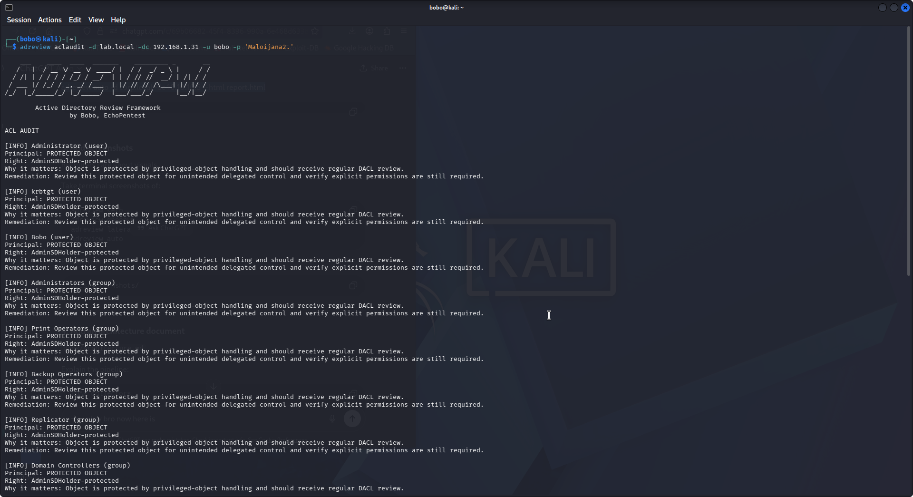

---

## delegaudit
Delegation configuration review.

Examines delegation configurations including:

- Unconstrained delegation
- Constrained delegation
- Resource-based constrained delegation

Purpose:

Detect delegation abuse paths.

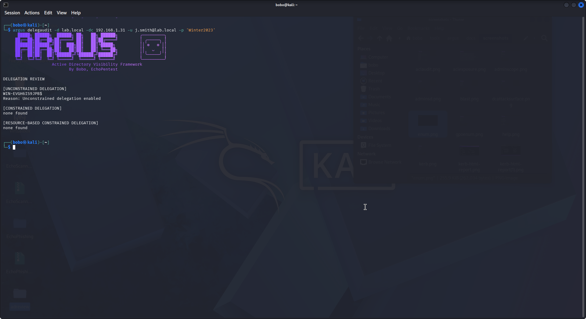

---

# PKI Modules

## adcs
Basic Active Directory Certificate Services review scaffold.

Enumerates certificate infrastructure components including:

- Certificate authorities
- Certificate templates

Purpose:

Provide foundation for PKI security review.

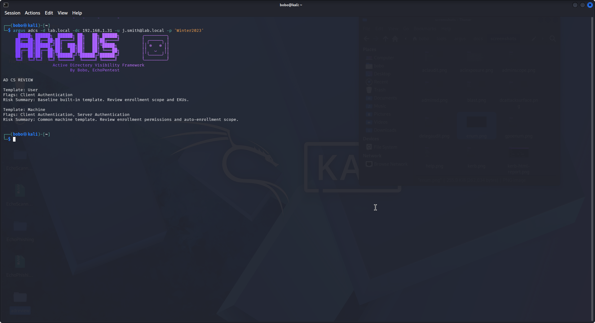

---

## certsurface
Certificate template surface review.

Analyzes certificate templates for risky configurations.

Purpose:

Identify potential ADCS exploitation vectors such as ESC paths.

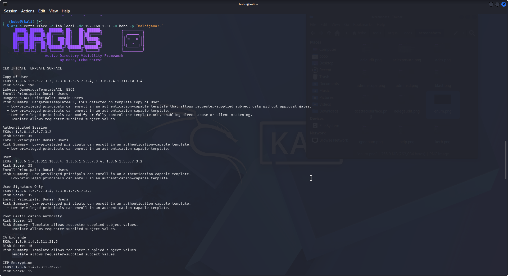

---

# Core Review

## auto
Run core review.

Executes a combined security assessment including:

- Enumeration
- Kerberos exposure review
- Misconfiguration review
- ADCS review

Purpose:

Provide a fast baseline security assessment of the domain.

