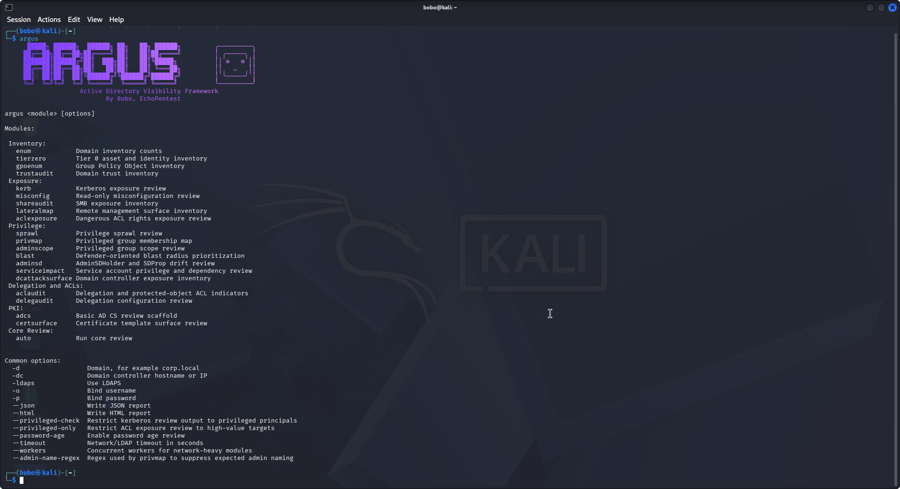
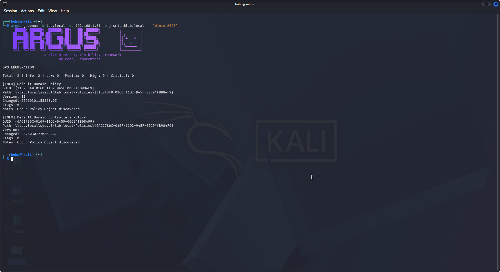
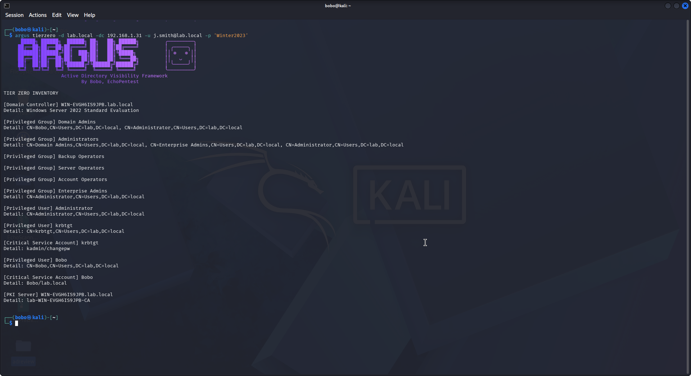
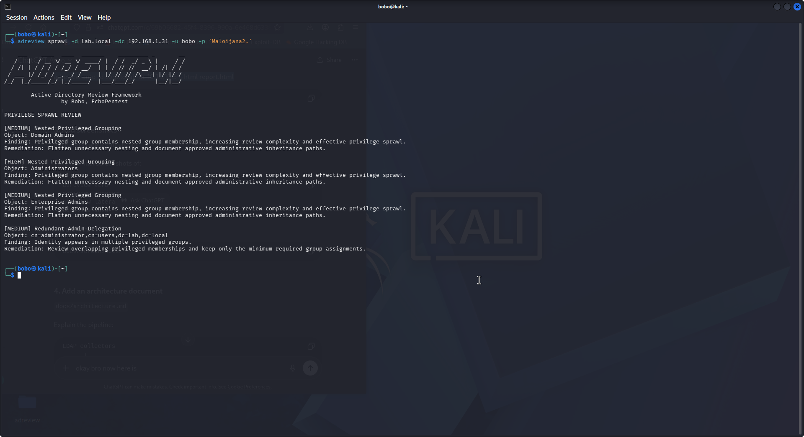

# Screenshots

The following screenshots demonstrate the CLI interface and HTML reporting capabilities of ADReview.

## adreview --help command

## Kerberos Module (CLI)

## Kerberos Module (HTML Report)

.png)

## GPO Enumeration

## Lateral Mapping

## Tier 0 Inventory

## Privilege Sprawl Review

